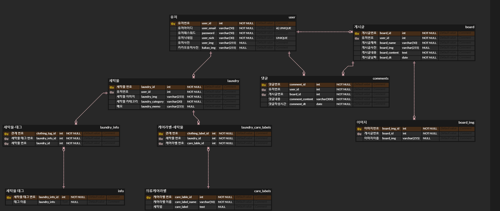
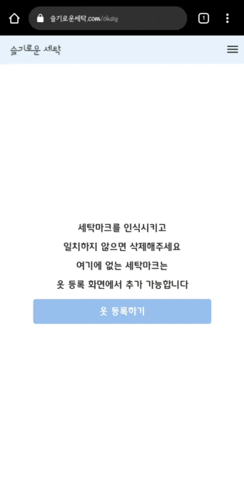
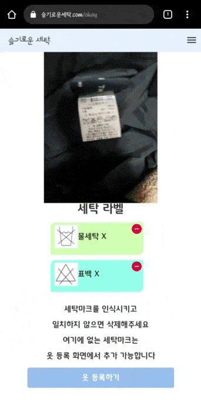

# README

# 세탁물 관리 및 세탁 방법 안내 서비스

# 목차

---

1. [서비스 소개](#서비스-소개)
2. [기술 스택](#기술-스택)
3. [메인 기능](#메인-기능)
4. [추가 기능](#추가-기능)
5. [팀원 소개](#팀원-소개)
6. [최종 산출물](#최종-산출물)
##서비스 소개

---

현재 국내 1인 가구 규모가 점점 증가하고 있으며 그에 따라 본인이 세탁하는 코인 빨래방의 시장 규모가 급격히 성장하고 있습니다. 하지만 **케어라벨**에 있는 **세탁 기호**를 인지하고 세탁 기호에 따라 세탁하는 것은 귀찮고 복잡합니다. 슬기로운세탁 서비스는 카메라를 통해 세탁기호를 인식하고 그에 맞는 세탁 방법을 추천하는 서비스입니다.

##기술 스택

---

### 아키텍쳐

### ERD

### 기능명세서

- [명세서 링크](https://docs.google.com/spreadsheets/d/1FMujGA1W-O-t9rmOsh3IL4n74dXonvrUDdUpa6ftezk/edit#gid=1090522501)

### TF Object Detection Model

## 메인 기능

---

### 메인페이지

- Weather, Near, 슬기로운 세탁, Login을 클릭하여 각 페이지로 이동할 수 있습니다.
- 로그인 한 사용자는 My Laundry, Community, Profile 페이지를 추가로 이용할 수 있습니다.
- 로그인은 일반 로그인과 카카오 Auth 로그인을 이용해서 할 수 있습니다.
- 4가지 단계를 통해 사용 방법을 확인할 수 있다. 각 단계 별로 설명하여 서비스를 설명합니다.
- start 버튼을 통해 세탁 마크를 인식하여 옷을 등록할 수 있습니다.

메인-메뉴

메인-슬기로운 세탁 시작하기

### 세탁 마크 인식

- 기기의 카메라를 통해 세탁 마크를 인식하고 인식된 마크를 나타내 인식된 마크를 표시합니다.
- 인식된 마크 중 잘못되어 있는 마크는 제거할 수 있도록 합니다.
- 인식 후 옷 등록하기 버튼을 통해 옷을 등록할 수 있습니다.

  

  세탁택 인식

### 옷 등록

- 세탁 주의 사항은  ⚠을 통해 각 세탁 마크에 대한 정보를 확인할 수 있으며 필요한 세탁 마크는 `+` 버튼을 통해 추가할 수 있습니다.
- 제품 설명 태그는 옷에 대한 정보를 추가하여 다른 사용자에게 정보를 공유할 수 있습니다.
- 메모를 통해 이외에 추가하고 싶은 설명, 내용을 작성하여 옷에 대한 설명을 추가할 수 있습니다.

  

  옷 등록

- 남의옷장에서 검색하기 ⇒ 내 옷장에서 수정하기

### My Laundry

- 모두의 옷장과 나만의 옷장을 통해 나만의 옷 뿐만 아니라 다른 사용자의 옷을 볼 수 있습니다.
- 세탁물 검색을 통해 찾고 싶은 세탁물을 검색할 수 있습니다.

**모두의 옷장**

- 제품 설명 태그를 통해서 각 옷의 정보를 확인할 수 있고 옷을 클릭하여 세부 정보를 확인할 수 있습니다.
- 옷을 클릭하여 옷의 세부 정보인 세탁 주의 사항, 제품 설명 태그, 메모와 이미지를 확인할 수 있습니다.

**나만의 옷장**

- 나만의 옷장 페이지에서는 세탁 마크를 쉽게 알 수 있도록 이미지와 세탁 마크를 나타내었습니다.
- 클릭을 통해 옷의 세부 정보인  세탁 주의 사항, 제품 설명 태그, 메모와 이미지를 확인할 수 있습니다.
- 수정하기 버튼을 통해 세부 정보들을 수정할 수 있습니다.
- 삭제하기 버튼을 통해 옷 정보를 삭제할 수 있습니다.

  

### Community

- 질문이나 정보 공유를 위한 게시판입니다. 각 질문을 작성하고 질문에 대한 댓글을 작성할 수 있습니다.
- 작성된 날짜 별로 정렬되며 조회순 버튼을 통해 내림차순으로 목록을 정렬할 수 있습니다.
- 검색을 통해 찾고 싶은 제목을 검색할 수 있습니다.
- 질문하기 버튼을 통해 제목, 이미지, 내용을 작성할 수 있으며 최대 5개의 이미지를 추가할 수 있습니다.
- 수정하기를 통해 제목, 내용, 이미지를 수정하며 삭제 버튼을 통해 질문을 삭제할 수 있습니다.

커뮤니티 글쓰기

커뮤니티 검색, 조회순, 댓글

### Profile

- 마이페이지에는 사용자의 프로필과 닉네임 정보를 확인할 수 있습니다.
- 프로필은 카메라 버튼을 통해 수정이 가능합니다.
- 수정 버튼을 통해 닉네임 변경이 가능하며 확인 버튼을 통해 수정을 완료합니다.
- 비밀번호 수정 버튼을 통해 변경할 비밀번호와 변경할 비밀번호 확인을 작성하고 확인 버튼을 통해 변경합니다.

  

## 추가 기능

---

### 세탁 지수

- 날씨, 온도, 강수 확률, 습도, 바람 등을 분석하여 빨래 지수를 알려주는 페이지 입니다.
- 현재 위치에서 2시간 간격으로 총 4개 시각의 빨래 지수를 알 수 있고, 클릭 시 상단에서 해당 시각의 정보를 볼 수 있습니다.
- 현재 위치를 x,y 축으로 계산해 서버로 보내고, 서버에서 기상청으로 부터 날씨를 받아와 바람지수 , 비올 확률, 습도,  온도 등으로 계산을 해서 다시 돌려주는 시간동안 여러 데이터의 그래프를 보여주며 이용자의 기다리는 시간을 즐겁게 해줍니다.
- 현재 날씨가 어떤지 직관적으로 보여지게 네가지의 날씨 종류(맑음,비,흐림,조금흐림) 를  애니메이션으로 만들었습니다.
- 또한 다크모드를 사용해 저녁의 느낌을 표현했습니다.

빨래지수 로딩창 및 시작화면

비오는날

맑은날

구름 적은날

구름 많은날

### 주위 세탁소

- 근처에 있는 세탁소의 위치를 알려주는 페이지 입니다.
- 공공데이터포털에서 전국 세탁소 현황 api를 이용해 총 40000개의 세탁소 위치를 받아오고 데이터를 알맞게 가공해 둡니다.
- 웹 페이지에 접속했을 때의 최적화를 위해 40000 개 중에 현재 위치를 기준으로 위도, 경도 반경 0.04° 안에 위치한 세탁소의 위치와 상호명만 알 수 있게 하였습니다.

### 반응형

- 모든 페이지에서 반응형 웹페이지를 구현하여 PC, 모바일 등 모든 환경에서 최적의 서비스를 제공받을 수 있습니다.

### 다크모드

- 다크모드와 라이트모드를 통해 사용자가 시각적으로도 편안한 서비스를 이용할 수 있게 하였습니다.

## 팀원 소개

- 장하석
    - **백엔드 개발**
    - ❤  **git** :  [https://github.com/Hasky96](https://github.com/Hasky96)
- 진은정
    - **백엔드 개발**
    - 💜 **git :** [https://github.com/NOO00OON](https://github.com/NOO00OON)
- 박성은
    - **백엔드 개발**
    - 💙 **git :** [https://github.com/qkrtjddms27](https://github.com/qkrtjddms27)
- 이혜진
    - **프론트 엔드 React 개발**
    - 🧡 **git :** [https://github.com/hy2jin](https://github.com/hy2jin)
- 문슬기
    - **프론트 엔드 React 개발**
    - 💛 **git :** [https://github.com/seulgi-mun](https://github.com/seulgi-mun)
- 임현홍
    - **프론트 엔드 React 개발**
    - 💚 **git :** [https://github.com/bbnerino](https://github.com/bbnerino)

---

## 최종 산출물

---

- [PPT](https://docs.google.com/presentation/d/160clmcWKJq6j1yH68sS-FmTWnBMe6YWf/edit#slide=id.p1)
- [슬기로운 세탁 홈페이지](https://xn--ok0by6qomhppbr9ieqr.com/)
- UCC