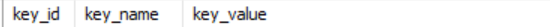

# FE 배포

```shell
# Client 폴더로 이동
cd Client

# Docker image 생성
docker build -t client .

# Docker Container 실행
# EC2 서버 내의 /etc/loacltime과 volume mount를 통해 시간대 통일
# EC2 서버 내의 /images와 volume mount를 통해 이미지 파일 연동
docker run -d -v /etc/localtime:/etc/localtime -v /images:/images -p 3000:3000 --name client client 
```

### FE 특이사항

* https 배포하지 않는다면 Client/.env 파일에서 포트 수정 필요(Websocket 이슈 해결을 위해 port를 443으로 설정)

# BE 배포

```shell
# Server/wiselaundry 폴더로 이동
cd Server/wiselaundry

# Gradle 빌드 실행
./gradlew build -x test

# Docker image 생성
docker build -t server .

# Docker Container 실행
# EC2 서버 내의 /etc/loacltime과 volume mount를 통해 시간대 통일
# EC2 서버 내의 /images와 volume mount를 통해 이미지 파일 연동
docker run -d -v /etc/localtime:/etc/localtime -v /images:/images -p 8080:8080 --name server server
```

### BE 특이사항

* Weather api 사용을 위해 Database의 secretkey 테이블에 key_name이 weatherApi 인 행 필요
  * 
